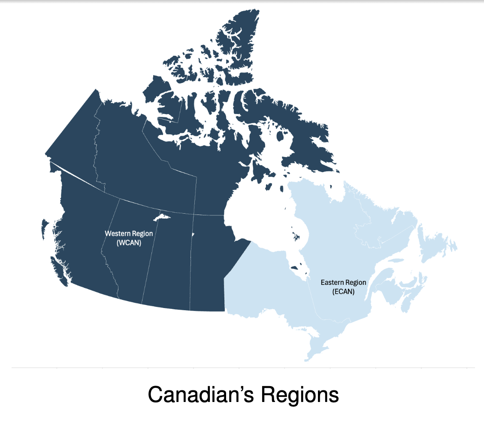
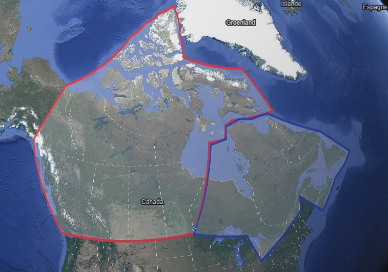

# Region for GERAD
In the following project, the work was done working with the GERAD institue , more particulary on a project lead by Olivier Bhan director of the institute.
In the project it was about Canada and to predict scenarios of evolution of temperatures  

With these regions, the project uses KML region created  with google earth, here is the google earth regions:
 
The choice was made because of some of the little island dont define a great difference in the economic way 
